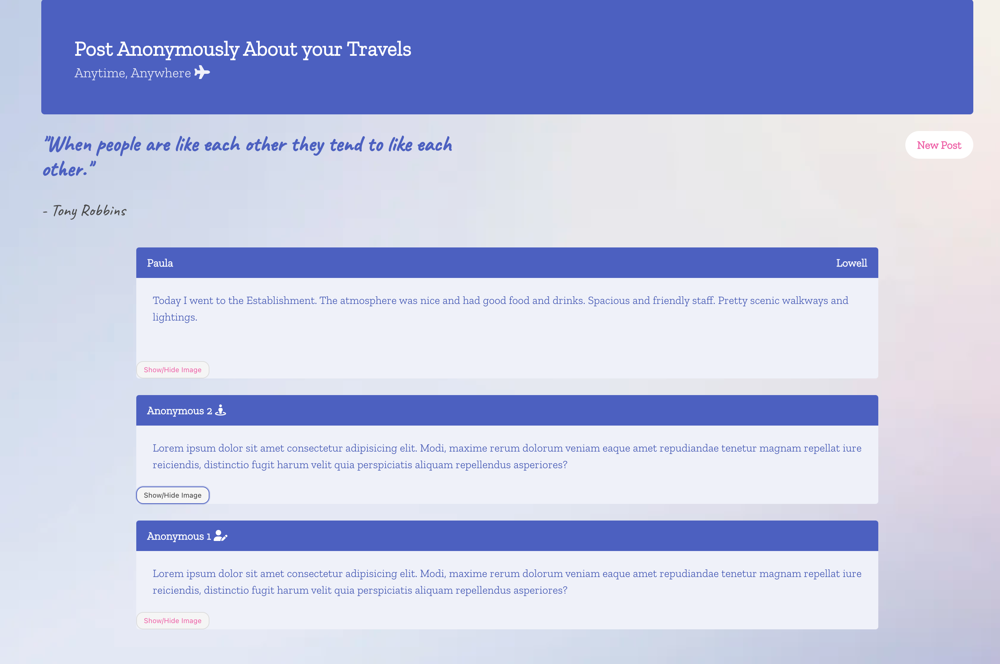

# Project 1// Group 5: Building An App with APIs 

Using APIs, HTML, CSS, and Javascript, aa online post application will be created that allow users to see other user's day experience and traveling stories. This application will run in the browser.
Link to [Application]:(https://pppreap.github.io/project1/)

# User Story for Scribe

An user wants to be able to view posts on other users' travels and daily thoughts. Scribe will be a place to share your daily thoughts and travels. How was your day? Do you want to share your experiences and connect with others? Post away on Scribe!

## Criteria

**You will need to run this application in a browser.**

There will be a post entry with **form inputs**. 

WHEN  the user **view each post** for that day,
THEN  the user is  **presented with the username, possible location/image and daily travel/day posts.** 

When the user view the **start page and the main page**,
an **inpsirational quote** is displayed on the page.

When the **user clicks new post**,
the user is able to **share their location and post to the page.**

When the users **click show/hide button**,
the user is able to **view the hidden image.**

### Assets
These are images of the working application.

#### Links
[Github Repository](https://github.com/pppreap/project1) 
///
[Link to Scribe](https://pppreap.github.io/project1/)

#### Credits
[Background Image](https://www.rawpixel.com/) ///
[CSS Frameworks]: Bulma by Jeremy Thomas. The source code is licensed MIT. The website content is licensed CC BY NC SA 4.0.](https://bulma.io/) //
[Icons]:(https://fontawesome.com/)
[Font]:(https://fonts.google.com/)
[APIs used]: [Unsplash](https://unsplash.com/developers) //  [Quotable](https://github.com/lukePeavey/quotable) // [Location: ipify](https://www.ipify.org/) & [ipgeolocation](https://ipgeolocation.io/)
